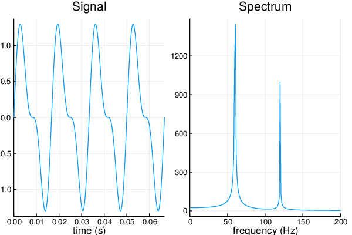

# Examples

Here you can find a list of examples to help you quick start using this
library.


# 1D signal

A simple real ``60 Hz`` with the first harmonics:

```julia
using Plots
using FFTW
using DSP

# Number of points
N = 2^12 - 1
# Sample spacing
Ts = 1 / (1.1 * N)
# Sample rate
fs = 1 / Ts
# Start time
t0 = 0
tmax = t0 + N * Ts

# time coordinate
t = t0:Ts:tmax

signal = sin.(2π * 60 * t) + .5 * sin.(2π * 120 * t)

# Fourier Transform of it
F = fftshift(fft(signal))
freqs =  fftshift(fftfreq(length(t), fs))

# Plot
time_domain = plot(t, signal, title="Signal", xlims=(0, 4 / 60), xlabel="time (s)", label="")
freq_domain = plot(freqs, abs.(F), title="Spectrum", xlims=(0, 200), xlabel="frequency (Hz)", label="")
plot(time_domain, freq_domain, layout = 2)
savefig("Wave.pdf")
```


